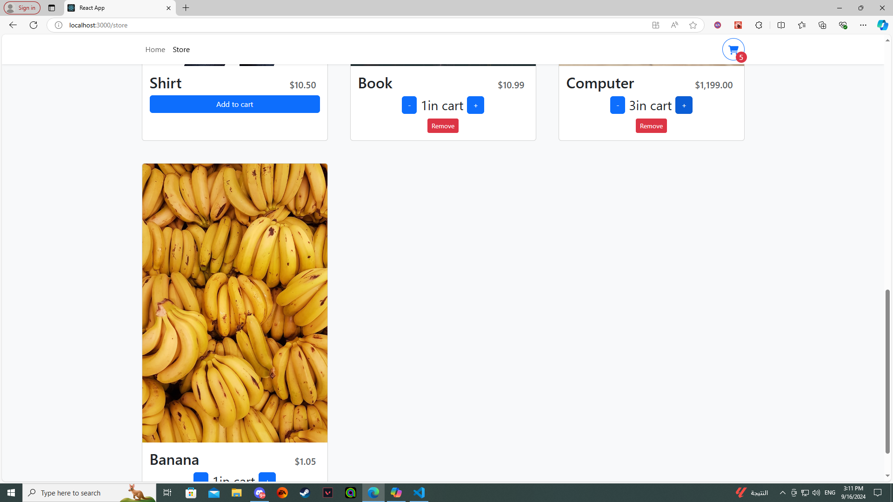
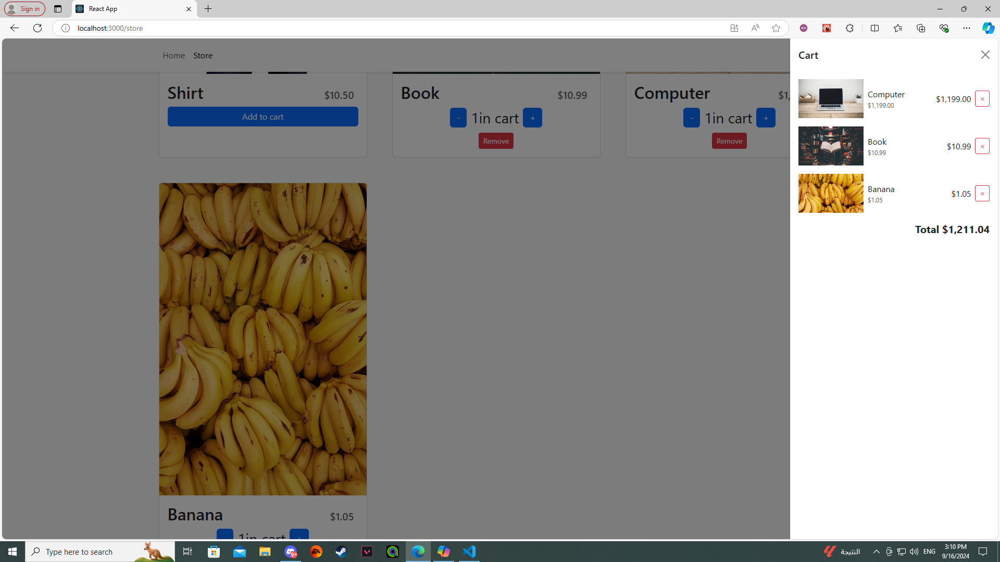
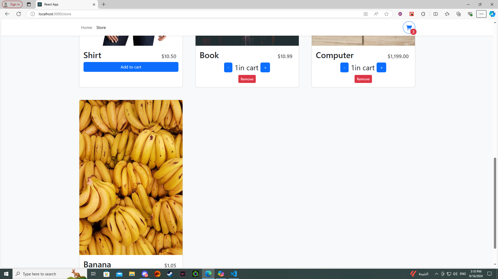
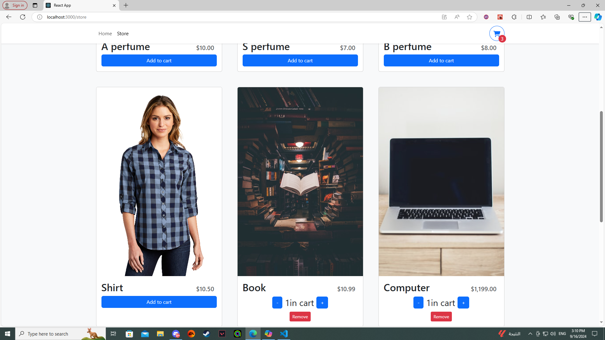

## Shopping Cart App

This is a shopping cart application built with React and styled using Tailwind CSS. The app allows users to browse products, add them to the cart, and proceed to checkout.

 ## Features
 Responsive Design: Fully responsive design using Tailwind CSS.
 Checkout: Proceed to checkout with the selected items.
 Cart Management: View and manage items in the cart.
Add to Cart: Add products to the shopping cart.
## Tech Stack
This shopping cart application is built with React, a JavaScript library for building user interfaces, and styled using Tailwind CSS, a utility-first CSS framework. It leverages the Context API for state management, React Router for navigation and routing, and Axios for making HTTP requests.

